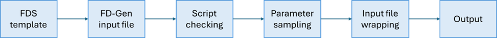
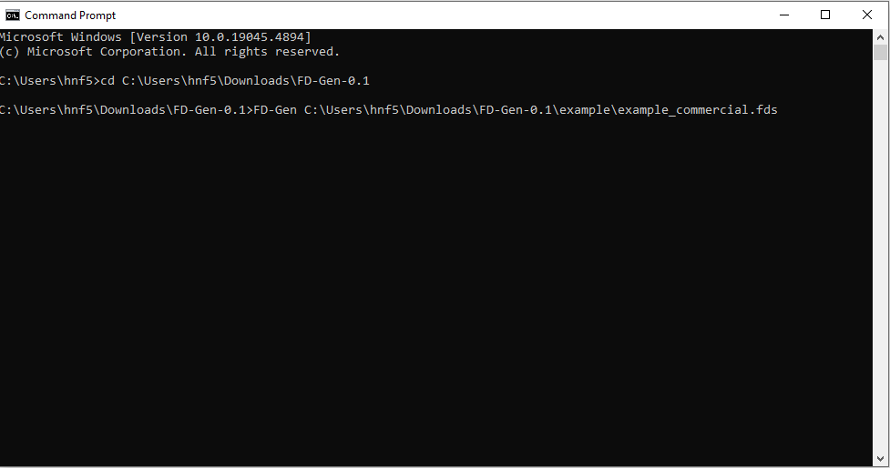
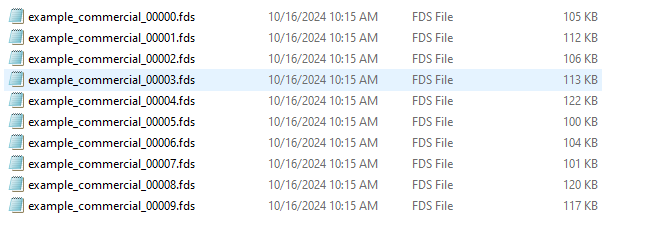
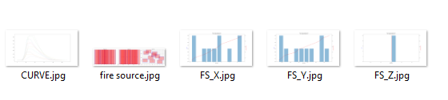
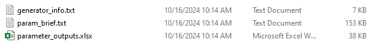
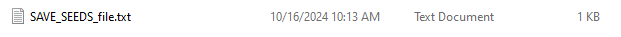

# Fire Data Generator (FD-Gen) Beta Version 0.1
## Release Notes

**Release Name**: FD-Gen Beta 0.1

**Release Date**: [Oct 15, 2024]

**Version**: 0.1 (Beta)


## Getting started
**Fire data generator (FD-Gen)** is a Python-based script tool designed to automate the creation of multiple FDS input files.
The tool is developed using the Python programming language. It reads parameters and commands from a text file that integrates FD-Gen syntax into an FDS input file template, enabling seamless customization and automation in the creation of FDS input files.

The workflow of FD-Gen is shown below. It consists of 6 main steps. The comprehensive documentation will be released soon.



**Figure 1.** FD-Gen framework.

## Usage appraoch 

### Step 1: prepare the FD-Gen input file.
To prepare the FD-Gen input file.

Each data generation project in FD-Gen is controlled by a paragraph of text-based script embedded within the original FDS input file. 
This script employs a namelist format to input parameters and values throughout the entire data generation process. 
This structured approach allows for clear organization and efficient manipulation of the fire parameters, facilitating seamless integration with the FDS framework.

The following folder contains several examples of prepared FD-Gen input files.

[**FD-Gen Input File Examples**](https://github.com/hqfang3/FD-Gen/tree/main/example)

### Step 2: analyze the input file with FD-Gen.
To open a CMD (Command Prompt) window, change the working directory to your local repository, and then read an input file using FD-Gen.
1. Open the Command Prompt.
2. Change the current working directory to your local repository.

    ```cmd
    cd path\to\your\repository
    ```

3. Read the input file with FD-Gen.

    ```cmd
    FD-Gen PATH_TO_INPUT_FILE
    ```


### Step 3: check the parameter sampling data.
After running the script for checking and parameter sampling, users can review the sampled parameter values in the **PARAMETER_FILE_FOLDER** located within the project folder. If the sampling aligns with the design, you can proceed with the program in the command (cmd) window. Otherwise, you'll need to return to the FD-Gen input file to modify the script guiding the parameter sampling.


### Step 4: wrap the FDS input file.
The wrapping process will automatically replace the sampled values with their corresponding original values within the script lines of the FDS template file. As a result, multiple FDS input files, as designed, will be generated and saved in the project folder under **CASE_FOLDER**.


### Step 5: acquire the outputs.
In addition to the spreadsheet containing the sampled parameter value information in the **PARAMETER_FILE_FOLDER** and the FDS input files in the **CASE_FOLDER**, FD-Gen also provides outputs to plot sampled fire source locations, HRR curves, and value distributions. These visual outputs give users a comprehensive view of the data and help ensure the reproducibility of the dataset. The output files are saved in the project folder under **OUTPUT_FOLDER**.


## Example

### Start
[**commercial building fire case**](https://github.com/hqfang3/FD-Gen/tree/main/example/example_commercial.fds)

1. downoad **FD-Gen.exe** and the example input file **example_commercial.fds**

2. open command prompt

3. Change the current working directory to your local repository

4. Read the input file with FD-Gen



**Figure 2.** read the input file.

5. check FD-Gen script and parameter sampling data.
type Y or y to continue the following step.

6. finish
project folder **example_commercial** will be created under the current working directory.

### Breakdown of the output files

**CASE_FOLDER**
The CASE_FOLDER contains multiple FDS case files generated based on the sampled values designed in the input FD-Gen file configuration. 



**Figure 3.** example of CASE_FOLDER.

**OUTPUT_FOLDER**
The OUTPUT_FOLDER contains visualizations of the sampled data, including plots of fire source locations, HRR curves, and specific value distributions. 



**Figure 4.** example of OUTPUT_FOLDER.

**PARAMETER_FILE_FOLDER**
The PARAMETER_FILE_FOLDER contains a spreadsheet with the sampled parameter values for each case, along with a text file providing a summary of the parameter values. 



**Figure 5.** example of PARAMETER_FILE_FOLDER.

**SEEDS_FOLDER**
The SEEDS_FOLDER contains the seeds used for the project, ensuring reproducibility of the sampling process in the future. 



**Figure 6.** example of SEEDS_FOLDER.

## Documentation
The documentation will be published as a NIST technical Note in the near future, providing detailed instructions and guidance on using FD-Gen.

## Acknowledgements

## Citation


